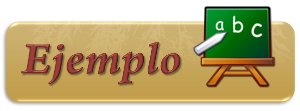

2. CONFECCIÓN
=================
Para la elaboración de un manual de usuario se deberán de integrar los siguientes apartados normativos.

2.1 Nombre del Sistema
++++++++++++++++++++++++

Nombre del sistema al que se refiere el manual. 

2.2 Versión del Sistema
+++++++++++++++++++++++++

La versión del sistema en el manual nos permitirá mantener un control sobre las modificaciones que han afectado al sistema original. 

2.3 Tipo de Manual
++++++++++++++++++++
Se especifica el tipo de manual al que se hace referencia, ya permitiendo tener un control en nuestros manuales, además de una fácil identificación. 

2.4 Poner una Imagen
++++++++++++++++++++++++
Es recomendable ilustrar el manual con una imagen 	representativa del sistema. 

2.5 Fecha de Elaboración
++++++++++++++++++++++++++
Es importante el incluir la fecha de elaboración, pues representa un punto de referencia y control. 

2.6 Area donde fue elaborado
+++++++++++++++++++++++++++++
Incluir el nombre del área en donde fue elaborado	el manual. 

2.7 Índice del Contenido del Manual
++++++++++++++++++++++++++++++++++++
Deberá contar con un índice y/o contenido del manual para facilitar su manejo e identificación de los puntos importantes, pues si sólo se busca un punto en específico con el índice es fácil identificarlo.

	#. **Presentación**: Breve descripción general del manual, debe contener lo siguiente:

		- *Antecedentes*: Describir las razones principales que propician la elaboración del sistema.

		- *Objetivos del Sistema*: Establecer los puntos importantes que cubrirá el sistema.

		- *Introducción*: Fundamentar la razón de ser del Sistema.

			| *A quién está dirigido el Manual*: Tipo de usuario al cual se dirige la información.
			| *Organización del Manual*: Enumerar de forma general el contenido del manual, con la finalidad de orientar y facilitar al usuario la búsqueda de temas.

 	#. **Generalidades del Sistema**: 

		- *Descripción del Producto*: Muestra las secciones que integran el sistema, la seguridad del mismo y su alcance.
		- *Uso de Teclas*: Se ilustrará con imágenes y se mencionará el uso que tiene cada una de las teclas del teclado que intervienen en el sistema.
		- *Botones Generales usados en el Sistema*: Mostrar con imágenes todos los botones, explicando su funcionamiento dentro del sistema.
		- *Ayudas del Sistema*: Describir las diferentes formas en las que se puede obtener ayuda mientras se trabaja con el sistema

